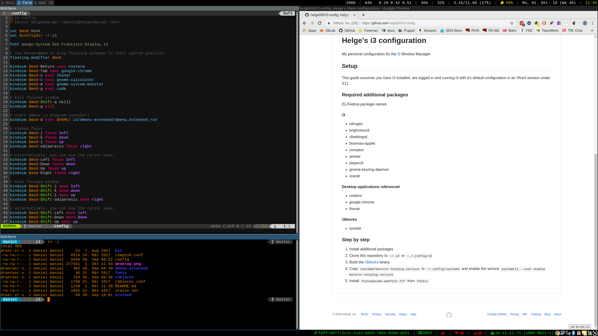

# Helge's sway configuration

My personal configuration for the [sway](https://github.com/swaywm/sway) Window Manager.



## Setup

This guide assumes you have SwayWM installed, are logged in and running sway with it's 
default configuration.

### Required additional packages
*EL/Fedora package names*

I use the Fedora module `sway:rolling/full`, this takes care of most if the binaries listed below:

```shell
$ sudo dnf module enable sway
$ sudo dnf module install sway:rolling/full
```

#### required packages
- [brighnessctl](http://rpmfind.net/linux/fedora/linux/releases/28/Everything/x86_64/os/Packages/b/brightnessctl-0.3-2.fc28.x86_64.rpm)
- ~~blueberry~~ (applet not working)
- ~~[compton](https://copr.fedorainfracloud.org/coprs/mrbloups/compton/)~~
- alsa-utils
- [playerctl](https://github.com/acrisci/playerctl)
- gnome-keyring-daemon
- [mako](https://github.com/emersion/mako)
- ~~xrandr~~
- ~~xnote~~
- [clipman](https://github.com/yory8/clipman) / [wl-clipboard](https://github.com/bugaevc/wl-clipboard) / [wofi](https://github.com/petabyteboy/wofi)
- nm-applet: compiled with [appindicator support](https://src.fedoraproject.org/rpms/network-manager-applet/pull-request/1)

#### Desktop applications referenced
- roxterm
- google-chrome
- thunar
- hunderbird-wayland
- ~~Zeal~~


#### i3blocks
- sysstat

### Step by step

1. Install additional packages
2. Clone this repository to `~/.i3` or `~./.config/i3`
3. Build the [i3blocks](https://github.com/vivien/i3blocks) binary
4. Copy `systemd/monitor-hotplug.service` to `~/.config/systemd` and enable the service
`systemctl --user enable monitor-hotplug.service`
5. Install `fontawesome-webfont.ttf` from `fonts/`
6. Check [dmenu-extended](https://github.com/MarkHedleyJones/dmenu-extended) dependencies

sudo dnf module install sway:rolling
